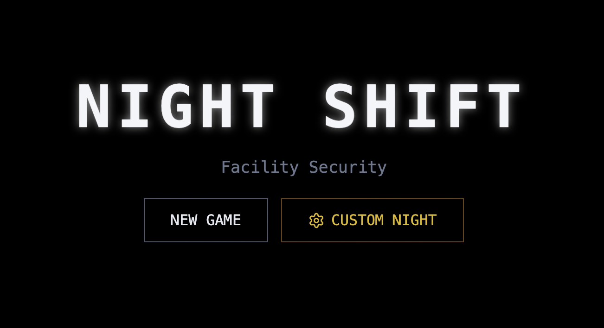

# Night Shift



**Night Shift** is a survival horror game inspired by *Five Nights at Freddy's*, built with **React**, **TypeScript**, and **Vite**.

Survive the night shift from 12 AM to 6 AM while monitoring animatronic mascots that roam the facility. Manage your limited power supply carefully—using doors, lights, and cameras consumes energy. If you run out of power, you're defenseless.

## 🎮 Gameplay Features

-   **Survive 5 Nights**: Progress through increasingly difficult nights with more aggressive AI.
-   **Power Management**: You have limited battery life. Closing doors, using lights, and checking cameras drains power.
-   **Camera System**: Monitor the facility to track the movements of **Unit-01 (Blue)** and **Unit-02 (Red)**.
-   **Office Defense**: Use door controls and hallway lights to protect yourself when animatronics are nearby.
-   **Custom Night**: Unlock a customizable 6th night where you can set AI difficulty levels (0-20).
-   **Immersive Audio**: Features a custom audio engine with dynamic ambience, sound effects, and positional cues.

## 🕹️ Controls

-   **Mouse**: Move your cursor to the edges of the screen to pan the office view.
-   **Click**: Interact with buttons (Door, Light, Camera Monitor).
-   **Monitor Button**: Toggle the security camera feed (bottom right).
-   **Settings**: Access the pause menu (top right gear icon).

## 🛠️ Tech Stack

-   **Framework**: React 19
-   **Build Tool**: Vite
-   **Language**: TypeScript
-   **Styling**: Tailwind CSS
-   **Icons**: Lucide React

## 🚀 Getting Started

1.  **Install dependencies:**
    ```bash
    npm install
    ```

2.  **Run the development server:**
    ```bash
    npm run dev
    ```

3.  **Build for production:**
    ```bash
    npm run build
    ```
